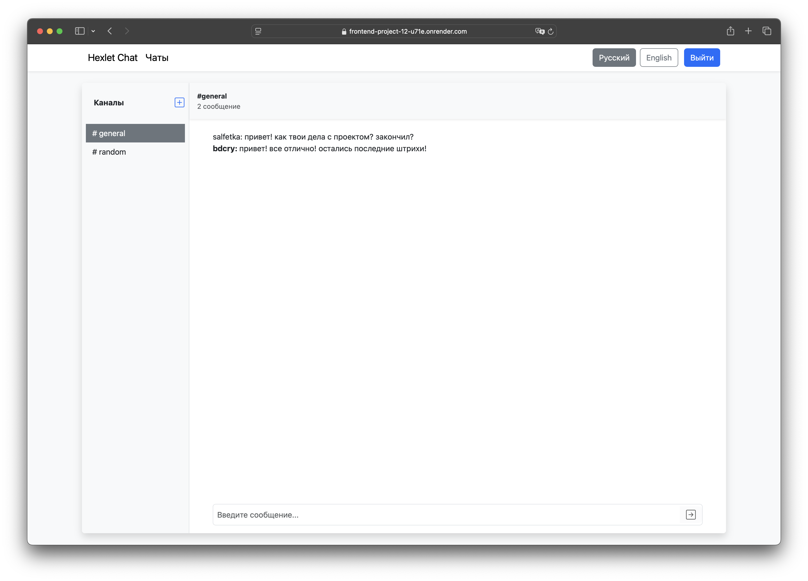
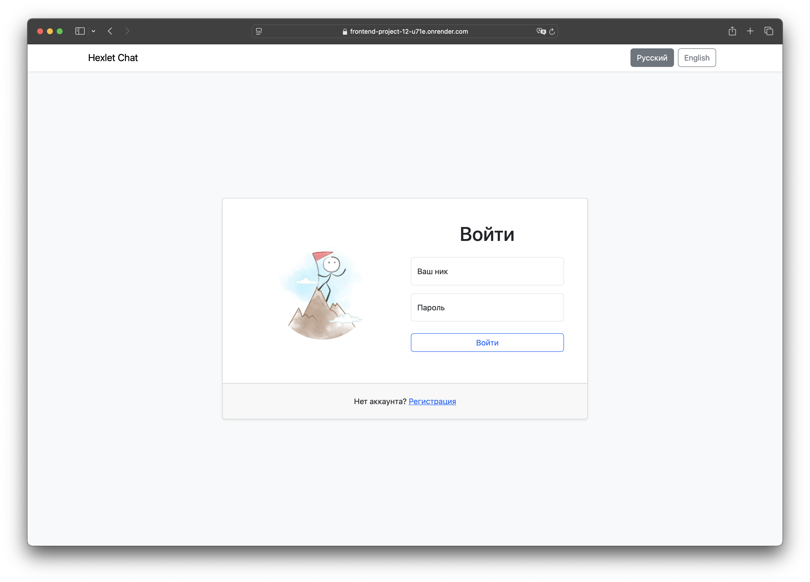
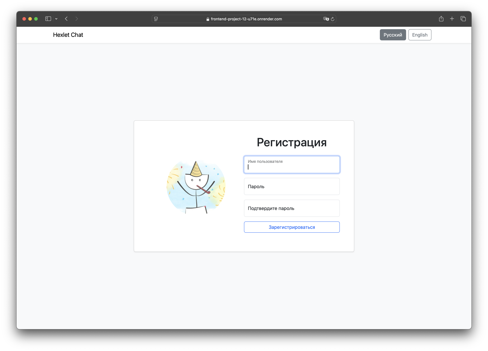
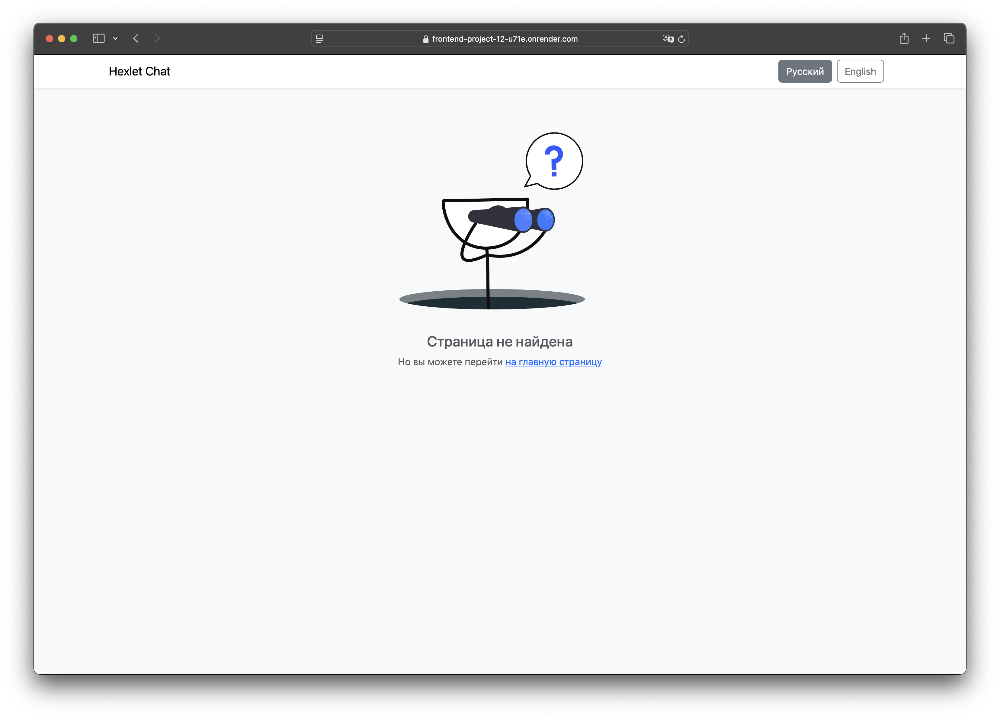
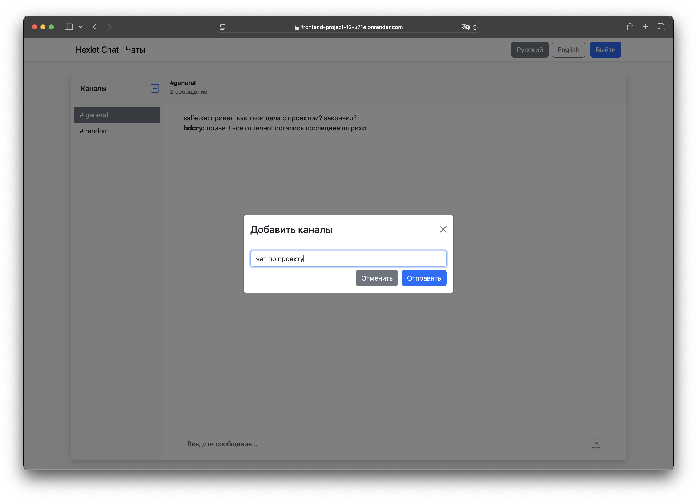
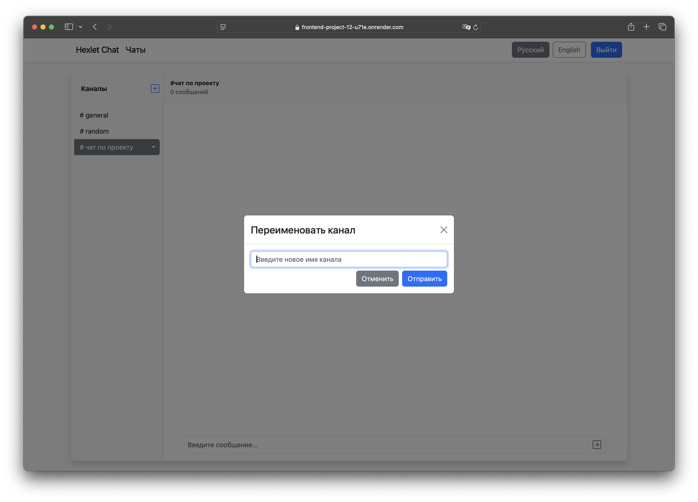
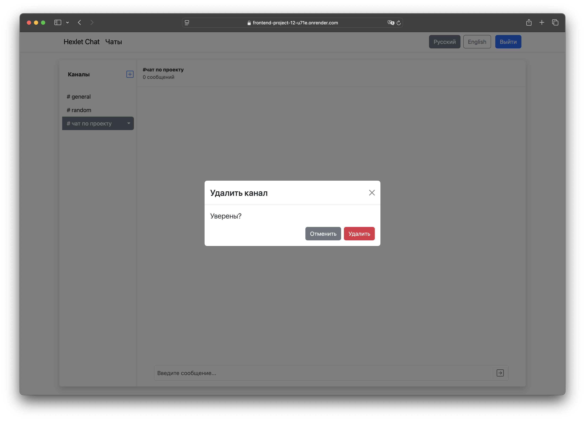

# Чат Slack

[](https://github.com/bdcry/frontend-project-12/actions) - Hexlet tests and linter status.

[](https://github.com/bdcry/frontend-project-12/actions/workflows/lint-check.yml) - Linter check status.

[](https://codeclimate.com/github/bdcry/frontend-project-12/maintainability) - Оценка Maintainability от Codeclimate.

[Чат Slack на Render](https://frontend-project-12-u71e.onrender.com) - Посетите развернутую версию проекта на Render.

## Описание проекта

**Чат Slack** — это сервис для общения, который предоставляет удобный интерфейс для работы с каналами и сообщениями. Пользователи могут создавать, редактировать и удалять каналы, а также отправлять сообщения в режиме реального времени благодаря поддержке веб-сокетов. Интерфейс разработан с использованием React-Bootstrap, что делает его интуитивно понятным и адаптивным.

Проект акцентирует внимание на разработке современных клиентских приложений, включая управление состоянием с помощью Redux Toolkit, реализацию роутинга, обработку асинхронных запросов и валидацию данных. Архитектура построена с использованием компонентного подхода, что упрощает поддержку и расширение функциональности.

### Технический стек

- **React**: для построения пользовательского интерфейса.  
- **Redux Toolkit + Thunk**: для управления состоянием приложения.  
- **React Router**: для реализации клиентского роутинга.  
- **Formik**: для работы с формами и валидацией данных.  
- **React-Bootstrap**: для создания адаптивного интерфейса.  
- **Axios**: для выполнения HTTP-запросов и взаимодействия с REST API.  
- **WebSockets**: для реализации обмена сообщениями в режиме реального времени.  
- **Vite**: для сборки и разработки приложения.  
- **Rollbar**: для мониторинга и обработки ошибок в продакшене.
- **i18next**: для реализации мультиязычности (доступны английский и русский языки).

## Цель

Этот проект был разработан для демонстрации следующих аспектов фронтенд-разработки:

- Работа с веб-сокетами для реализации обмена сообщениями в режиме реального времени.
- Взаимодействие с REST API для управления данными и обработки запросов.
- Использование React для создания интерфейсов с использованием хуков, контекста и оптимизаций производительности.
- Управление состоянием приложения с помощью Redux Toolkit, включая создание слайсов и использование встроенных функций.
- Реализация клиентского роутинга с использованием библиотеки React Router.
- Аутентификация и авторизация пользователей.
- Разработка форм с использованием библиотеки Formik, включая валидацию, обработку ошибок и управление состоянием форм.
- Создание адаптивного и доступного интерфейса с помощью React-Bootstrap.
- Реализация мультиязычности с использованием библиотеки i18next (поддерживаются английский и русский языки).
- Сборка приложения с использованием Vite и его деплой на продакшен.
- Мониторинг и обработка ошибок в продакшене с помощью сторонних сервисов (Rollbar).

## Скриншоты

### Главная страница
Главная страница приложения с отображением списка каналов и сообщений в реальном времени.


---

### Страница логина
Форма авторизации с валидацией введённых данных.


---

### Страница регистрации
Форма регистрации нового пользователя с проверкой корректности данных.


---

### Страница 404
Страница ошибки для случаев, когда запрашиваемый маршрут не найден.


---

### Модальное окно добавления канала
Окно для добавления нового канала с валидацией названия.


---

### Модальное окно переименования канала
Окно для редактирования названия существующего канала.


---

### Модальное окно удаления канала
Подтверждение удаления выбранного канала.


---

## Установка

1. Склонируйте репозиторий:

```sh
git clone https://github.com/bdcry/frontend-project-12.git
```

2. Перейдите в директорию проекта:
```sh
cd frontend-project-12
```

3. Установите зависимости:
```sh
make install
```

4. Сборка проекта:
```sh
make build
```

6. Запуск проекта:
```sh
make start && make start-frontend
```

6. Откройте в браузере:
```sh
http://localhost:8080
```

## Запуск через Makefile

1. Установка зависимостей:
```sh
make install
```

2. Линтинг кода:
```sh
cd frontend 
make lint
```

3. Запуск в режиме разработки:
```sh
make develop
```

4. Сборка проекта:
```sh
make build
```